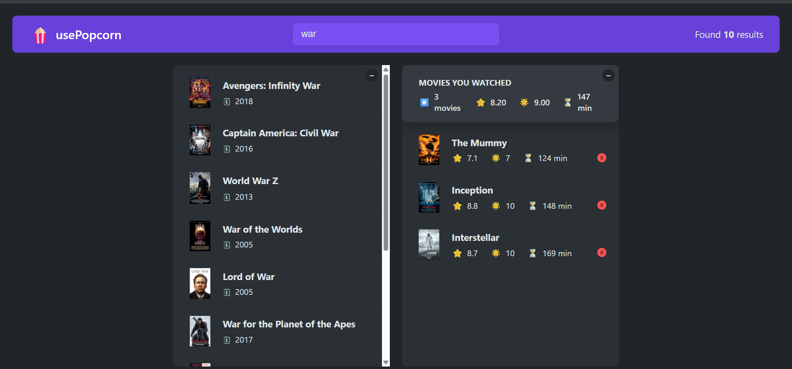

# 🍿 usePopcorn – Movie Search & Watchlist App

A React-based movie app that lets you search for movies, view their details, and maintain a personal watched list — all while learning key intermediate React concepts!

---

## 🚀 Live Demo

🔗 [https://usepopcorn-subodh.netlify.app](https://usepopcorn-subodh.netlify.app)

---

## 🧩 Features

- 🎥 Search movies using the **OMDb API**
- 📄 View detailed movie information (runtime, ratings, cast, etc.)
- ❤️ Add and remove movies from your personal _Watched List_
- 💾 Persistent storage using **localStorage**
- ⚡ Custom React Hooks for better reusability
- 🎛️ Dynamic document titles and keyboard shortcuts
- 🧭 Fully responsive and deployed on **Netlify**

---

## 🧠 What I Learned

This project helped me combine multiple intermediate-level React concepts into one practical app:

- Managing state effectively with **useState**
- Handling side effects and data fetching with **useEffect**
- Creating and reusing **custom hooks** (`useMovies`, `useLocalStorageState`, `useKey`)
- Working with async functions and handling API errors
- Component composition, conditional rendering, and prop drilling
- Using the **OMDb API** for real-world data

---

## ⚙️ Tech Stack

- **React.js**
- **JavaScript (ES6+)**
- **CSS / Flexbox**
- **OMDb API**
- **Netlify (Deployment)**

---

## 📸 Preview

> 

---

## 🧰 Installation & Setup

Clone the repository and install dependencies:

```bash
git clone https://github.com/subodh2708/usePopcorn.git
cd usepopcorn
npm install
npm start
```
